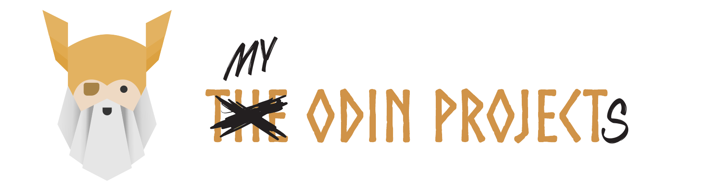

A collection of projects completed whilst working through [The Odin Project](https://www.theodinproject.com/) curriculum.

---

### **Foundations**
| Project                 | Repository                              | Live Demo  |
| ----------------------- | --------------------------------------- | ---------- |
| **Recipes**             | [Code](./foundations/01-recipes)           | [Demo](#)  |
| **Landing Page**        | [Code](./foundations/02-landing-page)      | [Demo](#)  |
| **Rock Paper Scissors** | [Code](./foundations/03-rock-paper-scissors) | [Demo](#) |

### **Full Stack Javascript**
*Coming soon as I progress through the curriculum...*

---

## ✨ My Learning Journey
This repository represents my progression from beginner to... well, we'll see where this journey takes me! Each project builds upon the previous ones, and you can see my skills developing over time.

Feel free to explore the code and see how I've tackled each challenge. Any feedback or suggestions are always welcome! 🚀