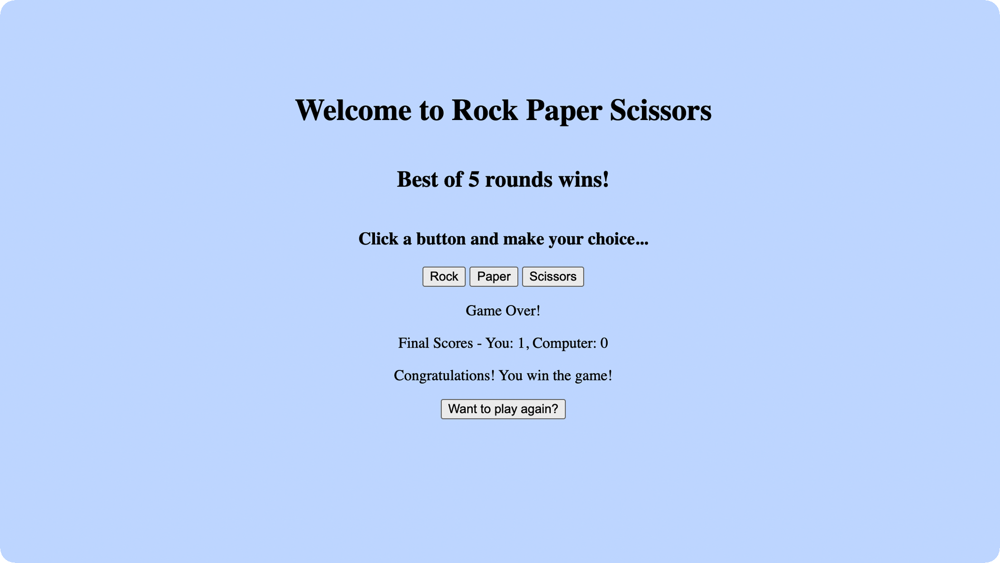

# 🪨📜✂️ Rock-Paper-Scissors

✨ [PLAY A GAME](https://rock-paper-scissors-pi-nine-45.vercel.app/)

---

A classic Rock Paper Scissors game with a basic interactive web interface.

This started as a simple console game where players typed their choices, but I've now added a proper user interface that makes the game much more user-friendly.

## ☑️ Features

- Interactive Interface: Click buttons to make your selection instead of typing
- Real-time Score Tracking: Watch the score update live as you play, so you always know where you stand
- First to Five Wins: The game continues until either you or the computer reaches 5 points.
- Visual Feedback: All game information is displayed clearly on the page, no need to check the browser console

## 🔮 Future improvements

- Improve styling to give the game more visual appeal
